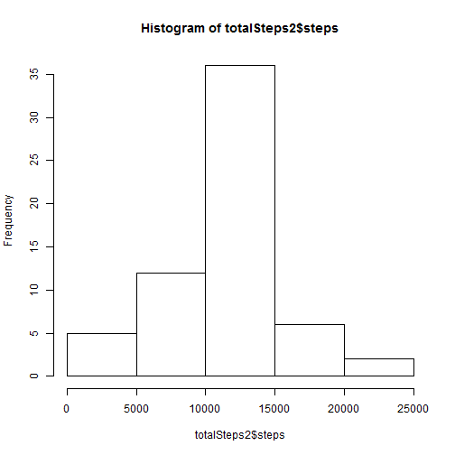

Reproducible Research: Peer Assessment 1
===================================================


## Loading and preprocessing the data

```r
actdata <- read.csv("activity.csv", na.strings = "NA", colClasses = c("numeric","Date","numeric"))
```
* Add up steps by date

```r
totalSteps<-aggregate(steps~date,data=actdata,sum,na.rm=TRUE)
```

## What is mean total number of steps taken per day?
* Histogram of the total number of steps taken each day

```r
hist(totalSteps$steps)
```


* Mean and median number of steps taken each day

```r
mean(totalSteps$steps)
```

```
## [1] 10766.19
```

```r
median(totalSteps$steps)
```

```
## [1] 10765
```
## What is the average daily activity pattern?
* Interval is identifier for the 5-minute interval in which measurement was taken
* mean of steps taken by interval

```r
stepsInterval<-aggregate(steps~interval,data=actdata,mean,na.rm=TRUE)
```
* Time series plot of the average number of steps taken

```r
plot(steps~interval,data=stepsInterval,type="l")
```


* The 5-minute interval that, on average, contains the maximum number of steps

```r
stepsInterval[which.max(stepsInterval$steps),]$interval
```

```
## [1] 835
```
## Imputing missing values

* My strategy is to fill the missing data using the mean for that 5-minute interval. The function interval2steps will generate the mean needed

```r
interval2steps<-function(interval){
    stepsInterval[stepsInterval$interval==interval,]$steps
}
```
* create a copy of the actdata


```r
actFilled<-actdata 
count=0 
for(i in 1:nrow(actFilled)){
    if(is.na(actFilled[i,]$steps)){
        actFilled[i,]$steps<-interval2steps(actFilled[i,]$interval)
        count=count+1
    }
}
cat("In total",count, "missing values were filled.\n\r") 
```

```
## In total 2304 missing values were filled.
## 
```
* Histogram of the total number of steps taken each day after missing values are imputed

```r
totalSteps2<-aggregate(steps~date,data=actFilled,sum)
hist(totalSteps2$steps)
```


## Are there differences in actdata patterns between weekdays and weekends?

* differentiate weekdays with weekends

```r
actFilled$day=ifelse(as.POSIXlt(actFilled$date)$wday%%6==0, "weekend","weekday")

actFilled$day=factor(actFilled$day,levels=c("weekday","weekend"))
```
* Panel plot comparing the average number of steps taken per 5-minute interval across weekdays and weekends

```r
stepsInterval2=aggregate(steps~interval+day,actFilled,mean)
library(lattice)
xyplot(steps~interval|factor(day),data=stepsInterval2,aspect=1/2,type="l")
```


